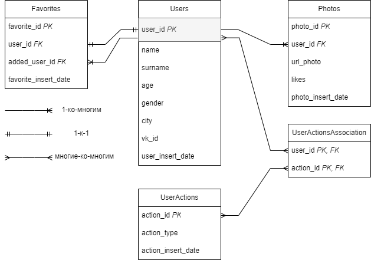

# VKinder - структура базы данных

Для обеспечения работы VK-бота, необходима PostgreSQL база данных. 

## Основные требования к БД по заданию
* В БД должно быть создано минимум 3 таблицы
* БД для программы реализована с помощью PostgreDB

## Блок-схема БД для VKinder

### Описание блок-схемы БД
Список таблиц и описание полей:
1. Пользователи (Users):
- user_id (Primary Key) - _ID пользователя_
- name - _Имя_ 
- surname - _Фамилия_ 
- age - _Возраст_ 
- gender - _Пол_ 
- city - _Город_ 
- vk_id - _Идентификатор ВКонтакте (для связи с профилем пользователя ВКонтакте)_
- user_insert_date - _Дата регистрации (для отслеживания, когда пользователь добавлен в БД)_

2. Фотографии (Photos):
- photo_id (Primary Key) - _ID фотографии_ 
- user_id (Foreign Key) - _ID пользователя (внешний ключ, связанный с таблицей Пользователей)_
- url_photo - _URL фотографии_ 
- likes - _Количество лайков_ 
- photo_insert_date - _Дата добавления_

3. Избранные пользователи (Favorites):
- favorite_id (Primary Key) - _ID связи_
- user_id (Foreign Key) - _ID пользователя (внешний ключ, связанный с таблицей Пользователей)_
- added_user_id (Foreign Key) - _ID избранного пользователя (внешний ключ, связанный с таблицей Пользователей)_
- favorite_insert_date - _Дата добавления в избранное_

4. Действия пользователя (UserActions):
- action_id (Primary Key) - _ID действия_
- action_type - _Тип действия (например, поиск, переход к следующему пользователю, сохранение в избранное)_
- action_insert_date - _Дата и время действия_

5.  Промежуточная таблица (UserActionsAssociation):
- user_id - _ID пользователя (внешний ключ, связанный с таблицей Пользователей)_
- action_id - _ID действия (внешний ключ, связанный с Действия пользователя)_
## SQL-скрипт по созданию таблиц и связей

TBA